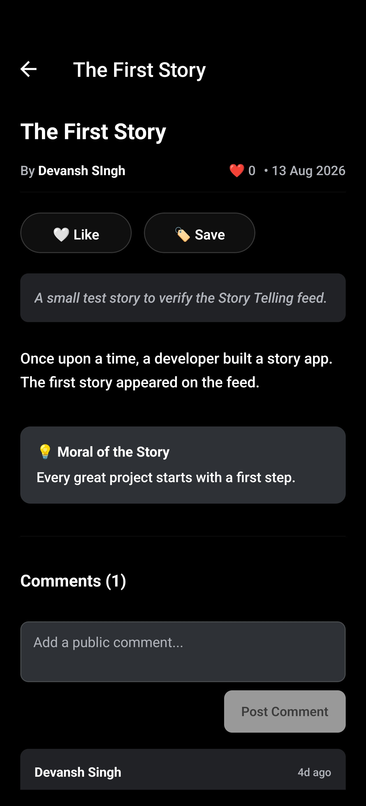
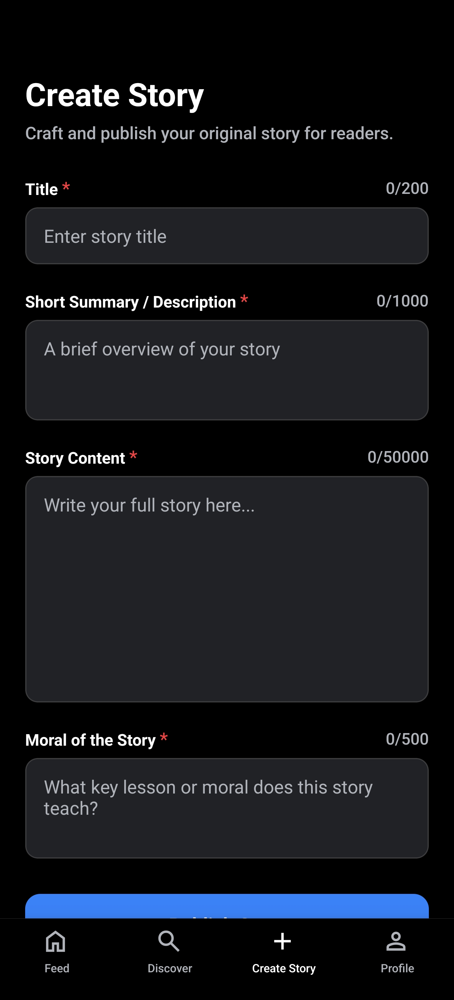

# StoryTelling

StoryTelling is a modern, high-performance mobile storytelling and social reading application built with **React Native**, **Expo**, and **Firebase**. Designed to deliver a seamless user experience, the app allows readers and authors to publish original stories, engage in community discussions through comments, show appreciation via likes, search for content, and bookmark their favorite stories for offline tracking.

This project showcases clean mobile application architecture, native authentication integrations, robust client-side state management with persistent theme configurations, and a secure serverless backend backed by rigorous Firestore Security Rules and automated emulator-based testing.

---

## Features

- **Story Feed**: A dynamically loaded stories feed showcasing published titles with layout optimization for standard mobile screens.
- **Story Creation & Editing**: A fully validated authoring suite allowing users to write, update, and manage their own stories with strict character limits (Title: 200, Description: 1000, Content: 50,000, Moral: 500) to ensure database integrity.
- **Search & Discovery**: Title prefix-based queries allowing fast, alphanumeric prefix search across all published story documents.
- **Atomic Likes System**: A transactional like/unlike engine that increments/decrements a story's total likes and syncs the count with the author's aggregate profile stats.
- **Interactive Comments**: Threaded story comments allowing authenticated users to share feedback, with parent story authors and comment authors having appropriate deletion privileges.
- **Denormalized Metrics**: Performance-optimized likes and comments counts denormalized onto the parent story document to prevent expensive document-read operations.
- **Custom Feed Sorting**: Feed sorting controls supporting sorting by `latest` (chronological), `mostLiked` (popularity), or `mostCommented` (engagement).
- **Cursor-Based Pagination**: Infinite scroll pagination on the home feed powered by Firestore `startAfter` cursor boundaries and a static page size of 10.
- **Saved & Bookmarked Stories**: A dedicated bookmarking system allowing users to save stories for quick access, resolving target document existence server-side before bookmarking.
- **Segmented Profile Screen**: User stats view (stories written, total likes received) alongside a custom tabbed navigation layout to toggle between authored and bookmarked stories.
- **Native Authentication**: High-security authentication utilizing native Google Sign-in with session persistence across app launches.
- **Adaptive Theme System**: Custom context-driven styling framework supporting Light and Dark modes with persistent configurations saved via local AsyncStorage.
- **Platform-Native Navigation**: Fully configured bottom-tab navigation using Expo Router with adaptive symbol icons rendering native SF Symbols on iOS and Google Material Symbols on Android.
- **Firestore Security Rules**: Strict server-side schema protection, data validations, and atomic transaction requirements covering all read/write pathways.

---

## Tech Stack

| Component | Technology | Description |
| :--- | :--- | :--- |
| **Framework** | React Native + Expo | Cross-platform native application framework (Expo SDK 57) |
| **Navigation** | Expo Router | File-based routing matching web and mobile standard conventions |
| **Language** | TypeScript | Strong typing for UI components, application logic, and model definitions |
| **Database** | Cloud Firestore | Real-time NoSQL document database |
| **Authentication**| Firebase Auth + Google Sign-In | Secure native single-sign-on integration |
| **Theme & UI** | Custom Style Engine | Dynamic dark/light mode engine using React Native Stylesheets |
| **Testing** | Jest + Firebase Emulator Suite | Local rule emulators and unit testing framework |

---

## Architecture

The project adheres to a clean, modular layer structure designed for scalability and testability:

- **`src/app/`**: Route definitions matching Expo Router conventions. Contains route groups for `(auth)` (login) and `(main)` (app tabs and sub-screens).
- **`src/components/`**: Reusable layout widgets and dumb components, including `StoryCard.tsx` and custom themed typography widgets.
- **`src/config/`**: Global service initializations (Firebase SDK config, native auth persistence configuration).
- **`src/constants/`**: Design tokens, color palettes, and base style constraints for light/dark themes.
- **`src/context/`**: Global React Context providers (such as the theme mode toggler).
- **`src/hooks/`**: Custom hooks for extracting application state (e.g., `useTheme`).
- **`src/services/`**: Centralized API calls divided into `auth` (native login controls) and `firebase` (atomic Firestore transactions for stories, likes, comments, profiles, and bookmarks).
- **`src/types/`**: Centrally managed TypeScript type definitions and Firestore document schemas.

---

## Firebase Configuration & Security

### 1. Authentication
The client application authenticates native Google Sign-in credentials, syncing them with Firebase Authentication. User profile documents are automatically created and initialized upon first sign-in.

### 2. Firestore Document Schemas
Database layouts are split into three root collections:
- `/users/{userId}`: Contains user metadata and stats (`totalLikesReceived`).
  - `/users/{userId}/savedStories/{storyId}`: Subcollection managing a user's bookmarked stories.
- `/stories/{storyId}`: Contains story metadata, metrics (`likesCount`, `commentsCount`), and content body.
  - `/stories/{storyId}/likes/{userId}`: Subcollection tracking individual story likes.
  - `/stories/{storyId}/comments/{commentId}`: Subcollection tracking story discussion comments.

### 3. Firestore Security Rules
All read and write permissions are locked down in `firestore.rules`:
- **Read Access**: Stories are readable by anyone. Profiles, comments, likes, and bookmarks require authentication.
- **Immutability**: Creation dates and original authors cannot be altered post-creation. Bookmarked stories cannot be updated.
- **Write validation**: Fields are type-checked and subject to maximum length checks (e.g. story content size validation).
- **Transactional Integrity**: Rules enforce that modifying a like or comment document must occur atomically alongside the corresponding update to the parent story counters, preventing out-of-sync indicators.

---

## Getting Started

### Prerequisites
- Node.js (v18+)
- Firebase CLI (for running rules unit tests)
- Expo Go app or an Android/iOS Emulator

### 1. Clone the Repository
```bash
git clone https://github.com/dslord/Story-Telling.git
cd Story-Telling/app
```

### 2. Install Dependencies
```bash
npm install
```

### 3. Configure Environment Variables
Create a `.env.local` file in the `app` root directory and populate it with your Firebase and Google Client credentials:
```env
EXPO_PUBLIC_FIREBASE_API_KEY=your_api_key
EXPO_PUBLIC_FIREBASE_AUTH_DOMAIN=your_project_id.firebaseapp.com
EXPO_PUBLIC_FIREBASE_PROJECT_ID=your_project_id
EXPO_PUBLIC_FIREBASE_STORAGE_BUCKET=your_project_id.firebasestorage.app
EXPO_PUBLIC_FIREBASE_MESSAGING_SENDER_ID=your_messaging_sender_id
EXPO_PUBLIC_FIREBASE_APP_ID=your_app_id
EXPO_PUBLIC_GOOGLE_WEB_CLIENT_ID=your_google_web_client_id
EXPO_PUBLIC_GOOGLE_IOS_CLIENT_ID=your_google_ios_client_id  # Optional, required for iOS builds
```

### 4. Start the Development Server
```bash
npx expo start
```
From the Expo CLI menu, press `a` for Android Emulator or `i` for iOS Simulator.

### 5. Running Android Development Builds
To generate and run a local native Android development build:
```bash
npx expo run:android
```

---

## Testing & Type Checking

To verify code quality and database security rules, the project utilizes two local testing steps:

### 1. Static Type Checking
Runs the TypeScript compiler to ensure strict typing is maintained:
```bash
npx tsc --noEmit
```

### 2. Firestore Security Rules Unit Tests
Uses Jest and the Firebase Emulator Suite to run 56 comprehensive, isolated test cases covering all CRUD pathways, validations, and transactional counters:
```bash
npx firebase-tools emulators:exec "npx jest scripts/firestore.rules.test.js --runInBand"
```

---

## Project Structure

```
├── android/                   # Native Android configuration
├── assets/                    # Application icons, splash screen assets
├── scripts/                   # Local build and test scripts
│   └── firestore.rules.test.js # Security rules unit test suite
├── src/
│   ├── app/                   # Expo Router routes & layouts
│   ├── components/            # Reusable UI widgets
│   ├── config/                # Firebase connection details
│   ├── constants/             # Styling & design tokens
│   ├── context/               # Application-wide React Contexts
│   ├── hooks/                 # Custom React Hooks
│   ├── services/              # Auth & database services
│   └── types/                 # TypeScript interfaces
├── app.json                   # Expo application manifest
├── firebase.json              # Firebase CLI configuration
├── firestore.rules            # Security rules for Firestore
├── package.json               # Package dependencies & scripts
└── tsconfig.json              # TypeScript compilation setup
```

---

## Screenshots

| Feed | Story Details | Create Story | User Profile |
| :---: | :---: | :---: | :---: |
|  |  |  |  |

---

## Development Notes

- **Optimistic UI Updates**: Dynamic states such as liking, unliking, bookmarking, and deleting comments are managed with local state changes for zero-latency user interactions, backed by asynchronous Firestore calls.
- **Native Asset Optimization**: Core branding icons are optimized to support Android Adaptive Icons (with monochrome support for themed systems) and high-density iOS splash configurations with a centering navy base theme (`#0D1B2A`).
- **Atomic Database Operations**: Counters and stats are kept in sync by grouping actions (like writing comments and updating comments count) into atomic `runTransaction` operations. This ensures that the frontend always displays correct statistics.

---

## License

This project is licensed under the MIT License. See the [LICENSE](LICENSE) file for details.

Developed by **dslord**.
